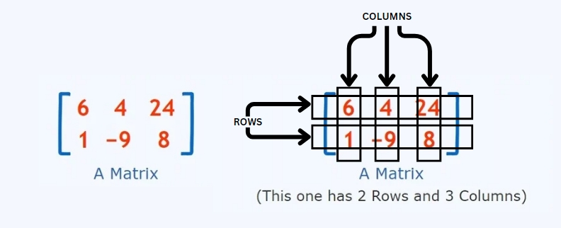

## An Analysis of Matrix Multiplication Using Code

### Mathematical Intuition

**What is a Matrix**

- A matrix is a rectangular arrangement of numbers into rows and columns.
- The order of a matrix is written in the form `m x n` where:
  - `m` -> Number of rows
  - `n` -> Number of columns




**How to Multiply Two Matrices**

To multiply a matrix by another matrix, we need to perform the "dot product" of rows and columns. Here’s how it works:

- Let `A` be a matrix of order `m x n` and `B` be a matrix of order `p x q`.
- To multiply `A` and `B`, the number of columns in `A` (`n`) must be equal to the number of rows in `B` (`p`) i.e `n == p`
- The resulting matrix `C` from the multiplication of `A` and `B` (denoted as `A x B = C`) will be of order `m x q`.

**The Multiplication Process**

- If `C_{ij}` is the element of matrix `C` located in the `i`-th row and `j`-th column, then:

$$
c_{ij} = \sum_{k=1}^{n} (a_{ik} \times b_{kj})
$$

- This means `C_{ij}` is the sum of the products of the elements from the `i`-th row of matrix `A` and the `j`-th column of matrix `B`.


**Code Implementation**
```
for (i = 0; i < m; i++)
    for (j = 0; j < q; j++) {
        // Initialize each element of C to 0
        C[i][j] = 0; 
        for (k = 0; k < n; k++)
            C[i][j] += A[i][k] * B[k][j]; 
        // Accumulate the sum of products
        }
```
*Explanation:*
- `C[i][j] = 0;` initializes the `i`, `j` element of the result matrix `C` to zero before adding up the products.
- `C[i][j] += A[i][k] * B[k][j];` computes the dot product of the `i`th row of matrix `A` and the `j`th column of matrix `B`, then adds it to `C[i][j]`.

- Outer Loops `(i and j)`: Iterate through each element in the resulting matrix `C`.
- Inner Loop `(k)`: Perform the summation of products of the corresponding elements in row `i` of `A` and column `j` of `B`

*C Code :*
```C
#include <stdio.h>
#include <stdlib.h>

// Function to perform matrix multiplication
void multiplyMatrices(int **A, int **B, int **C, int m, int n, int q) {
    for (int i = 0; i < m; i++) {
        for (int j = 0; j < q; j++) {
            C[i][j] = 0; // Initialize the element to 0
            for (int k = 0; k < n; k++) {
                C[i][j] += A[i][k] * B[k][j]; // Accumulate the sum of products
            }
        }
    }
}

// Function to allocate and initialize a matrix
int** allocateMatrix(int rows, int cols) {
    int **matrix = (int**)malloc(rows * sizeof(int*));
    for (int i = 0; i < rows; i++) {
        matrix[i] = (int*)malloc(cols * sizeof(int));
    }
    return matrix;
}

// Function to free the allocated memory for a matrix
void freeMatrix(int **matrix, int rows) {
    for (int i = 0; i < rows; i++) {
        free(matrix[i]);
    }
    free(matrix);
}

// Function to print a matrix
void printMatrix(int **matrix, int rows, int cols) {
    for (int i = 0; i < rows; i++) {
        for (int j = 0; j < cols; j++) {
            printf("%d ", matrix[i][j]);
        }
        printf("\n");
    }
}

int main() {
    int m, n, p, q;

    // Input dimensions for matrix A
    printf("Enter the number of rows and columns for matrix A (m x n): ");
    scanf("%d %d", &m, &n);

    // Input dimensions for matrix B
    printf("Enter the number of columns for matrix B (p x q): ");
    scanf("%d %d", &p, &q);

    // Check if multiplication is possible
    if (n != p) {
        printf("Matrix multiplication is not possible. Number of columns in A must be equal to number of rows in B.\n");
        return 1;
    }

    // Allocate memory for matrices
    int **A = allocateMatrix(m, n);
    int **B = allocateMatrix(p, q);
    int **C = allocateMatrix(m, q);

    // Input matrix A
    printf("Enter elements of matrix A:\n");
    for (int i = 0; i < m; i++) {
        for (int j = 0; j < n; j++) {
            scanf("%d", &A[i][j]);
        }
    }

    // Input matrix B
    printf("Enter elements of matrix B:\n");
    for (int i = 0; i < p; i++) {
        for (int j = 0; j < q; j++) {
            scanf("%d", &B[i][j]);
        }
    }

    // Multiply matrices
    multiplyMatrices(A, B, C, m, n, q);

    // Print result matrix
    printf("Product matrix C (A x B) is:\n");
    printMatrix(C, m, q);

    // Free allocated memory
    freeMatrix(A, m);
    freeMatrix(B, p);
    freeMatrix(C, m);

    return 0;
}

```


